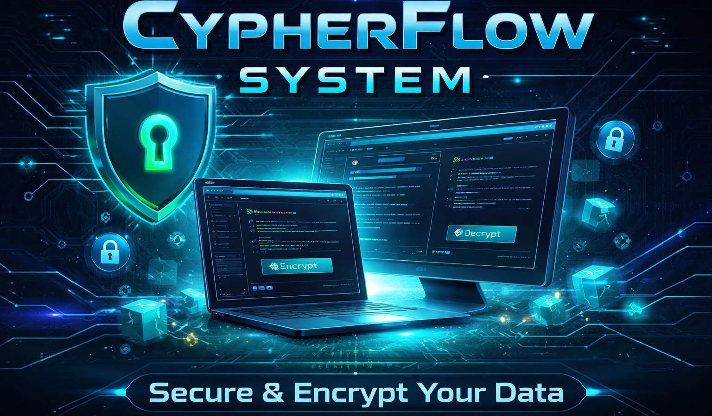

# CIPHER FLOW SYSTEM
## 📝 Description

CIPHER FLOW SYSTEM is a secure file management software that allows encrypting and decrypting text, PDF, and RTF files.  
The program offers the following features:
- Encrypt File
 ```
Encrypts one or multiple files using a unique password and a complexity version.
```
- Decrypt File
```
Decrypts files that were previously encrypted with the corresponding password.
```
- Encryption Planning
```
Schedules the encryption for a future time according to a given time.
```
- Decryption Planning
```
Schedules the decryption of encrypted files according to a given time.
```
- Security Level Visualization
```
Displays the strength of the chosen password, from “ULTRA-SECURE” to “RISKY”, using ASCII graphical output.
```
## 💻 Technical Features
- Dynamic management of multiple files with safe memory allocation.
- Verification and confirmation of user inputs for passwords, versions, and files.
- Calculation of password security level based on character repetition and complexity.
- Scheduling with full date and system time verification to automatically start encryption.
- Security depends on the chosen password and version, not on official cryptographic standards.
- Enhanced console interface:
  - Visual effects with type_effect() to simulate progressive typing.
  - Dynamic color changes for important steps (color_change()).
  - Windows alerts via MessageBox().
## 🔐 Usage Example
Run the program from the console:
```
Bash
FILE_CRYPTER.exe
```
Choose a menu option:
```
1 → Encrypt File
2 → Decrypt File
3 → Encryption Planning
4 → Decryption Planning
5 → Exit
```
Follow the instructions to input file name, extensions, password, and version.  
Encrypted files are created with the suffix (ENCRYPTED) or -crypt depending on the selected mode.
## 🧠 Educational Goals
This project allows understanding and applying:
- File management in C (fopen, fclose, getc, fprintf).
- Dynamic memory manipulation (malloc, calloc, free).
- Structures (struct) to organize information about files and passwords.
- Basic encryption logic using a key based on a password and version.
- Console / Windows interactions to create a simple yet effective user interface.
## ⚠️ Limitations
- Works only on Windows.
- Does not support paths containing spaces (use _ instead).
## ⚙️ Technologies 
- **Language:** C
- **Compiler:** GCC or any standard C compiler.
## 🛠️ Build & Compilation
```
gcc main.c function.c -o FILE_CRYPTER.exe -lwinmm
```
## ▶️ Execution
```
Bash
./FILE_CRYPTER.exe
```
## ## 📚 Documentation

For a detailed explanation on how to use:

- 👉 [View Full User Guide](assets/docs/USER_GUIDE.md)
## 📄 License
This project is licensed under the . See [License](LICENSE) for details.
---

## 🌍 FRENCH VERSION

[](assets/docs/README-fr.md)
